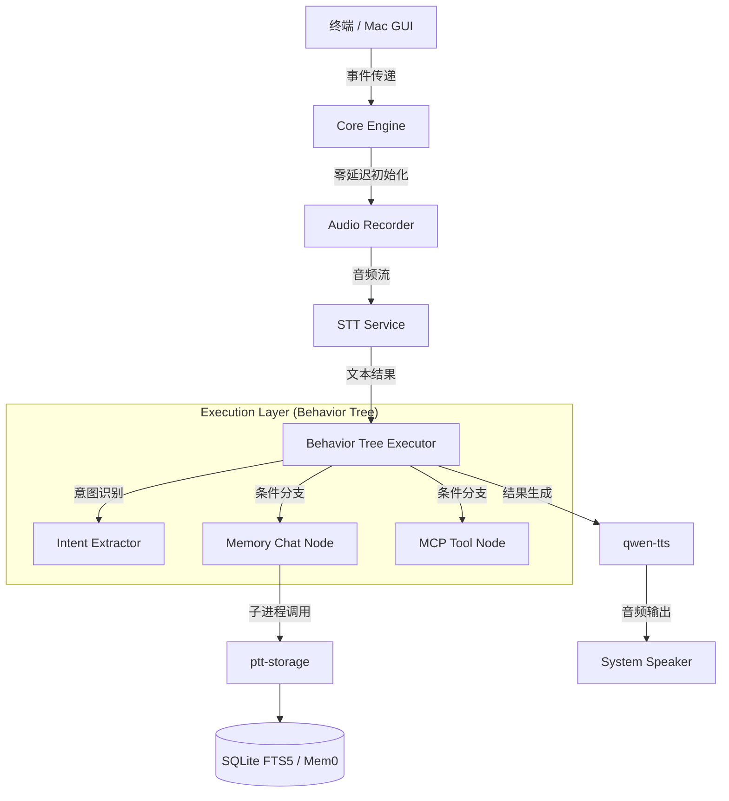

# 🎙️ Press-to-Talk (PTT) 语音助手

`press-to-talk` 是一个高性能、本地优先的智能语音助手系统。它采用**行为树 (Behavior Tree)** 架构驱动任务执行，通过物理隔离的存储层确保数据安全，旨在提供“按下即录音、松开即执行”的极速交互体验。

---

## ✨ 核心特性

- **🚀 零阻塞启动**：极简初始化路径，确保程序启动后瞬间进入录音状态。
- **🌲 行为树引擎**：采用 Behavior Tree (BT) 架构，逻辑清晰，拒绝臃肿的 `if-else` 链路。
- **🛡️ 存储隔离**：通过独立的 `ptt-storage` 模块进行数据操作，支持 SQLite FTS5 (本地) 与 Mem0 (云端) 双引擎。
- **👥 多用户隔离**：内置 API Key 鉴权机制，严格隔离不同用户的会话历史与记忆数据。
- **🔌 灵活扩展**：支持 MCP (Model Context Protocol) 工具调用（如 Brave Search），TTS 默认集成 `qwen-tts`。
- **🖥️ 多端支持**：提供 Rich 动态终端 UI，并支持编译高性能的 Swift Mac GUI。

---

## 🚀 快速开始

### 1. 环境准备

确保已安装 [uv](https://github.com/astral-sh/uv)。在根目录创建 `.env` 文件：

```bash
OPENAI_API_KEY=your_key
OPENAI_BASE_URL=your_base_url
PTT_STT_URL=your_stt_endpoint
PTT_STT_TOKEN=your_stt_token
PTT_API_KEY=your_default_user_token
```

### 2. 常用运行命令

系统提供了一系列标准 CLI 工具：

| 功能 | 命令 | 说明 |
| :--- | :--- | :--- |
| **实时交互** | `uv run press-to-talk` | 启动语音交互链路 (或 `ptt-voice`) |
| **文本测试** | `uv run press-to-talk --text-input "你好"` | 跳过录音进行逻辑测试 |
| **API 服务** | `uv run ptt-api` | 启动 FastAPI 后端服务 (端口 10031) |
| **存储管理** | `uv run ptt-storage` | 管理历史记录与记忆 (物理隔离层) |
| **令牌管理** | `uv run ptt-token` | 管理多用户 API Keys |

---

## 🏗️ 系统架构



---

## 🛠️ 开发者指南

### 行为树开发
执行层代码位于 `press_to_talk/execution/bt/`。添加新功能时，请优先考虑增加新的 Behavior Tree 节点。

### 外部提示词管理
**硬约束**：严禁在 Python 代码中硬编码提示词。请在以下文件中进行配置：
- `workflow_config.json`: 全局工作流与 LLM 提示词。
- `intent_extractor_config.json`: 意图识别规则。

### Mac GUI 编译
如需更新 macOS 原生界面：
```bash
cd mac_gui
swift build -c release
```

### 自动化测试
提交代码前必须通过全量测试：
```bash
uv run poe test
```

---

## 📜 许可证

Apache License 2.0

---
<tts>README 已更新，同步了行为树架构和最新运行指令。</tts>
