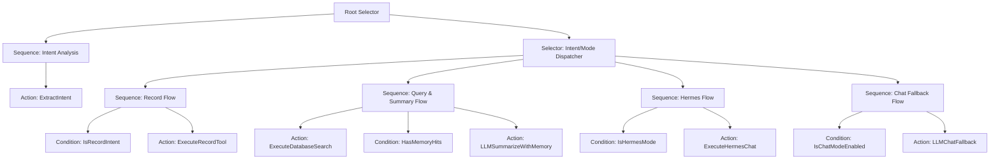

# 设计文档：基于行为树的执行链路重构 (Execution Layer Refactor)

为了解决 `press-to-talk` 项目中执行链路逻辑日益复杂、`if-else` 嵌套导致难以维护且易出错的问题，我们将 `execution` 层重构成基于行为树（Behavior Tree, BT）的声明式架构。

## 1. 目标 (Goals)
- **稳定性**：通过结构化的树形逻辑，消除复杂的 `if-else` 嵌套。
- **可预测性**：链路分叉清晰，每个节点职责单一，执行流向明确。
- **可扩展性**：新增功能（如新的意图、新的 MCP 工具）只需增加或替换节点，不影响现有逻辑。
- **易于调试**：日志可以精确记录树的 `tick` 过程，方便定位执行在哪一步分叉或失败。

## 2. 核心架构设计

### 2.1 基础组件 (Core Components)
- **Blackboard (黑板)**：一个共享的上下文对象，存储输入（transcript）、配置（cfg）、中间状态（intent, memories）和最终结果（reply）。
- **Status (状态)**：节点执行的结果，包括 `SUCCESS`（成功）, `FAILURE`（失败）, `RUNNING`（运行中）。
- **Node (基础节点)**：所有逻辑的基类。
    - **Action (动作节点)**：执行具体操作（如调用 LLM, 查询数据库）。
    - **Condition (条件节点)**：判断黑板中的状态（如是否为记录意图, 是否有记忆命中）。
    - **Composite (组合节点)**：控制子节点的执行流。
        - **Sequence (顺序器)**：按顺序执行子节点，直到遇到 `FAILURE`（全成才成）。
        - **Selector (选择器)**：按顺序执行子节点，直到遇到 `SUCCESS`（一成即成）。

### 2.2 统一主树结构 (Unified Master Tree Structure)



## 3. 详细设计 (Detailed Design)

### 3.1 黑板内容 (Blackboard Schema)
```python
class Blackboard:
    transcript: str      # 输入文本
    cfg: Config         # 全局配置
    intent: dict        # 解析出的意图 payload
    memories: list      # 数据库查询结果
    mode: str           # 当前执行模式 (database, memory-chat, hermes)
    reply: str          # 最终生成的回复文本
    error: str          # 错误信息
```

### 3.2 关键节点说明
- **ExtractIntent**: 使用 LLM 或简单规则分析意图，并写入黑板。
- **IsRecordIntent**: 检查 `Blackboard.intent` 是否为 `record`。
- **ExecuteDatabaseSearch**: 执行 FTS5 和向量查询，结果存入 `Blackboard.memories`。
- **HasMemoryHits**: 检查 `Blackboard.memories` 是否非空。
- **LLMSummarizeWithMemory**: 结合 `Blackboard.memories` 生成总结回复。
- **LLMChatFallback**: 当数据库未命中且模式允许时，进行开放域对话。

## 4. 实施计划 (Implementation Plan)

### 步骤 1: 基础设施搭建
创建 `press_to_talk/execution/bt/` 目录，定义 `base.py` (Status, Node, Composite)。

### 步骤 2: 节点实现
在 `press_to_talk/execution/bt/nodes.py` 中实现所有的 Action 和 Condition 节点，逻辑从现有的 `memory_chat.py` 和 `agent.py` 中迁移。

### 步骤 3: 树的组装与集成
在 `press_to_talk/execution/bt/builder.py` 中声明式组装大树，并在 `press_to_talk/execution/__init__.py` 中替换掉原有的 `execute_transcript` 逻辑。

### 步骤 4: 验证
通过现有的意图测试用例，确保重构后的逻辑与预期一致。

## 5. 风险评估 (Risk Assessment)
- **开销**：轻量级 BT 实现几乎没有性能开销。
- **复杂性**：初始学习成本略高，但长期维护成本极低。
- **回滚**：旧的实现将暂时保留，直到新链路完全稳定。
