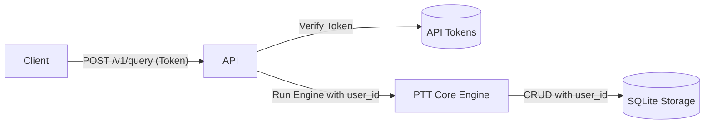

# API 与多用户存储隔离设计方案

> **状态**: 待审批
> **目标**: 为 Press-to-Talk 提供基于 FastAPI 的 HTTP API，支持自然语言查询，并实现严格的基于 Token 的用户数据隔离。

## 1. 架构概览

API 层作为外部访问的唯一入口，通过 `Authorization` 头部获取 API Token，在内部将其映射为 `user_id`。所有后续的存储操作（历史、记忆）都必须强制带上此 `user_id` 进行过滤。



## 2. 存储实现 (Peewee ORM)

为了确保数据库操作的安全性和健壮性，我们将引入 **Peewee** 作为 ORM 组件。

### 2.1 模型定义
我们将定义以下模型，所有模型（除 `APIToken` 外）都包含 `user_id` 字段：

- **APIToken**: `token` (PK), `user_id`, `description`, `created_at`
- **SessionHistory**: `session_id` (Unique), `user_id`, `started_at`, `ended_at`, `transcript`, `reply`, `peak_level`, `mean_level`, `auto_closed`, `mode`, `created_at`
- **RememberEntry**: `id` (PK), `user_id`, `source_memory_id`, `memory`, `original_text`, `created_at`, `updated_at`

### 2.2 多用户隔离逻辑
在 `StorageService` 中，我们将通过 Peewee 的查询 API 强制注入 `user_id` 过滤条件：
```python
# 示例
def list_history(self, user_id, limit=10):
    return SessionHistory.select().where(SessionHistory.user_id == user_id).limit(limit)
```

## 3. API 接口定义 (Swagger/OpenAPI)


所有接口必须通过 `POST` 方法访问，以符合“不公开暴露查询逻辑”的安全要求。

### 3.1 `POST /v1/query`
- **功能**: 执行自然语言查询。
- **请求体**: `{"text": "最近三天的记录"}`
- **内部实现**: 
    - 捕获当前 `user_id`。
    - 调用 `press_to_talk.core.main(['--text-input', '--no-tts'])`。
    - **隔离实现**: 通过修改 `StorageService` 在运行时根据上下文注入 `user_id`。
- **响应**: 引擎输出的 JSON 结果。

### 3.2 `POST /v1/history`
- **功能**: 结构化获取历史记录。
- **参数**: `limit`, `query` 等。
- **响应**: 属于该用户的历史列表。

### 3.3 `POST /v1/memories`
- **功能**: 结构化获取长短期记忆。
- **响应**: 属于该用户的记忆列表。

## 4. 安全与隔离策略

1. **Token 鉴权**: 使用 FastAPI 的 `HTTPBearer` 安全方案。
2. **零泄露**: 任何 API 的 Payload 或响应中严禁出现 `user_id` 字段。该 ID 仅在服务器内部逻辑中使用。
3. **强制隔离**: 
    - `StorageService` 构造函数将支持 `user_id` 参数。
    - 所有 SQL 查询语句必须包含 `WHERE user_id = ?` 子句。
    - 插入操作必须自动填充 `user_id`。
4. **异常处理**: Token 无效时返回 `401 Unauthorized`，禁止给出关于 `user_id` 的任何暗示。

## 5. 迁移计划

1. 创建迁移脚本 `scripts/migrate_v2_multi_user.py`。
2. 更新 `press_to_talk/storage/models.py`。
3. 更新 `press_to_talk/storage/sqlite_history.py` 和 `press_to_talk/storage/providers/sqlite_fts.py`。
4. 在 `press_to_talk/api/` 实现 FastAPI 应用。
5. 更新 `pyproject.toml` 增加 API 启动脚本。

---
<tts>大王，设计已就绪。Token 隔离用户，内部逻辑对公网完全透明，确保安全！</tts>
