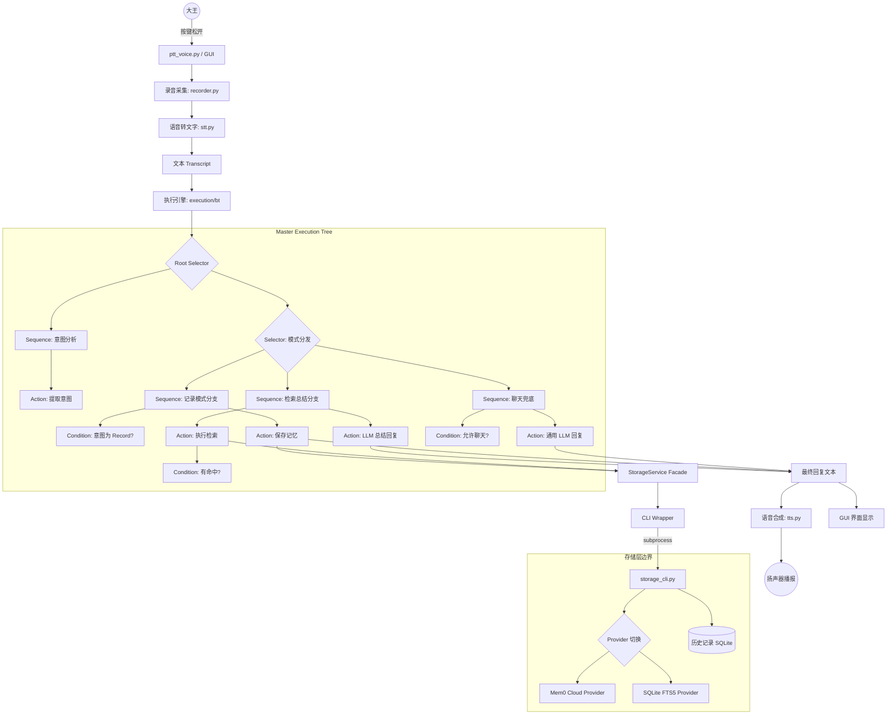

# 语音助手系统架构分析 (System Architecture)

> **创建日期：** 2026-04-19
> **状态：** 已根据 2026-04-18 行为树重构计划完成梳理

## 1. 核心链路概述

本项目是一个基于“按键触发 (Press-to-Talk)”模式的智能语音助手。其核心流程遵循：**音频采集 -> 语音转文字 (STT) -> 意图识别 -> 行为树执行 -> 存储检索 (CLI 隔离) -> 结果反馈 (TTS/GUI)**。

## 2. 详细流程图 (Mermaid)

## 3. 关键设计特性

### 3.1 行为树 (Behavior Tree) 执行引擎
- **位置**: `press_to_talk/execution/bt/`
- **优势**: 取代了传统的 `if-else` 嵌套逻辑。通过 `Blackboard` (黑板) 模式共享上下文。
- **节点类型**:
    - `Selector`: 只要有一个子节点成功就返回成功（用于分支切换）。
    - `Sequence`: 所有子节点必须全部成功（用于线性任务流）。
    - `Action/Condition`: 具体的逻辑单元（如 LLM 调用、数据库查询判断）。

### 3.2 存储层边界隔离 (Storage Decoupling)
- **实现方式**: 主程序不直接访问数据库，而是通过 `subprocess` 调用 `storage_cli.py`。
- **优势**: 
    - **纯净度**: 存储层不包含 LLM 逻辑，只负责数据增删改查。
    - **稳定性**: 数据库操作异常不会直接导致主程序崩溃。
    - **多后端支持**: 可以在 `Mem0` (云端) 和 `SQLite FTS5` (本地) 之间无缝切换。

### 3.3 多 Provider 记忆架构
- **核心类**: `BaseRememberStore`
- **支持**: 
    - `Mem0RememberStore`: 云端记忆，利用 Mem0 平台的向量检索能力。
    - `SQLiteFTS5RememberStore`: 本地记忆，结合 FTS5 全文检索与向量嵌入 (Embedding)。

## 4. 目录职责划分

- `/press_to_talk/execution`: 执行层，包含行为树节点与组装器。
- `/press_to_talk/storage`: 存储层，包含 Provider 实现与 CLI Wrapper。
- `/press_to_talk/audio`: 音频处理（录音、STT、TTS、提示音）。
- `/press_to_talk/agent`: 意图识别与 LLM 交互逻辑。
- `/mac_gui`: Swift 实现的 macOS 客户端界面。
- `/docs`: 设计规范与实施计划。
