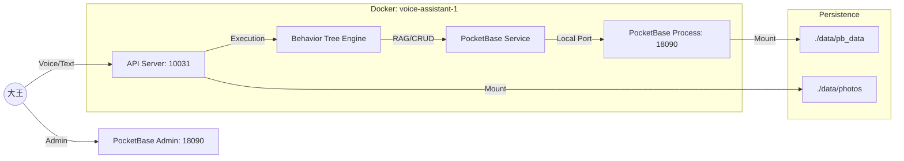

# 语音助手系统架构 (System Architecture)

> **最后更新：** 2026-05-02
> **当前版本：** v2.0 (PocketBase 架构优化)

## 1. 核心链路
本项目是一个基于“按键触发 (Press-to-Talk)”模式的智能语音助手。核心流程如下：
**音频采集 -> 语音转文字 (STT) -> 意图识别 -> 行为树执行 -> PocketBase 存储检索 -> 结果反馈 (TTS/GUI)**

## 2. 架构拓扑 (Docker 环境)
系统通过 Docker Compose 编排，直接暴露两个核心端口：

- **10031 (API Server)**: 处理自然语言查询、历史记录与记忆管理。
- **18090 (PocketBase)**: 核心存储引擎，提供 Admin UI 与直接数据访问。

```mermaid
graph LR
    User((大王)) -->|Voice/Text| API[API Server: 10031]
    User -->|Admin| PB_UI[PocketBase Admin: 18090]
    
    subgraph Container [Docker: voice-assistant-1]
        API -->|Execution| BT[Behavior Tree Engine]
        BT -->|RAG/CRUD| PB_Service[PocketBase Service]
        PB_Service -->|Local Port| PB_Process[PocketBase Process: 18090]
    end
    
    subgraph Storage [Persistence]
        PB_Process -->|Mount| Vol[./data/pb_data]
        API -->|Mount| Assets[./data/photos]
    end
```

## 3. 关键设计特性

### 3.1 行为树 (Behavior Tree)
- **核心位置**: `press_to_talk/execution/bt/`
- **逻辑分发**: 使用行为树取代复杂的 `if-else`。通过 `Blackboard` (黑板) 共享上下文。
- **模式**: 支持 `memory-chat` (RAG模式) 和 `database` (指令模式)。

### 3.2 PocketBase 存储层
- **统一后端**: 取代了旧的 SQLite/Mem0 混合架构，实现配置、历史、记忆的统一存储。
- **多用户隔离**: 通过 API 层的 `user_id` 注入实现逻辑隔离。
- **数据持久化**: 映射宿主机 `./data/pb_data`，确保容器销毁后数据不丢失。

### 3.3 多模态记忆
- **图片关联**: 支持上传照片并与记忆关联。
- **资源访问**: 通过 `/assets` 路由直接访问 `data/photos` 目录下的原始文件。

## 4. 目录职责划分

- `/press_to_talk`: 核心逻辑包。
    - `/api`: FastAPI 服务入口及鉴权。
    - `/execution`: 行为树节点与执行引擎。
    - `/storage`: PocketBase 存储适配器。
    - `/audio`: 录音、STT 与 TTS 逻辑。
- `/scripts`: 启动脚本（PocketBase 下载与运行、部署脚本等）。
- `/web_gui`: 基于 HTML/JS 的前端交互界面。
- `/mac_gui`: Swift 实现的 macOS 原生浮窗客户端。
- `/data`: 宿主机持久化目录（数据库文件、照片附件）。

## 5. API 规范
详见 [API v1 文档](./api/v1.md)。
主要接口：
- `POST /v1/query`: 执行自然语言查询。
- `POST /v1/history`: 获取会话历史。
- `POST /v1/memories`: 获取长期记忆。
